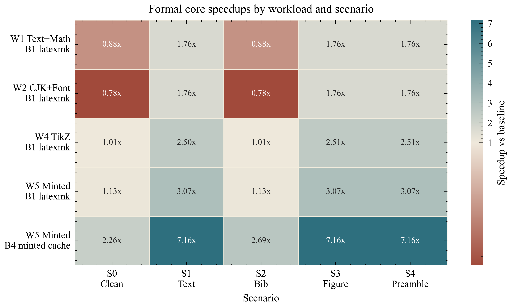

# FastXeBench

[](https://github.com/handsomeZR-netizen/fastxebench)
[](https://github.com/handsomeZR-netizen/fastxebench/stargazers)
[](https://github.com/handsomeZR-netizen/fastxebench/commits/main)
[](paper/main.pdf)
[](#protocol)
[](#experimental-setup)
[](#experimental-setup)
[](#paper-and-artifact)

FastXeBench is a reproducible benchmark and fidelity study of **edit-to-PDF latency** for **XeLaTeX on Windows**.  
It measures the latency that authors actually feel during iterative writing loops, not just clean-build time, and couples performance claims with explicit PDF fidelity checks.

> Edit. Rebuild. Inspect the PDF. Repeat.  
> FastXeBench benchmarks the loop that real XeLaTeX authors actually wait on.

This repository is the public artifact for the FastXeBench paper and benchmark harness:

- workload-aware XeLaTeX benchmarking on Windows
- a `prime + measure` protocol for incremental edit scenarios
- PDF fidelity checks based on whole-file hashes and page-level raster comparison
- paper-ready figures, tables, and analysis assets generated from recorded datasets



## At a glance

| Item | Public release |
| --- | --- |
| Paper | [`paper/main.pdf`](paper/main.pdf) |
| Core protocol | `v0.2-prime-measure` |
| Formal core matrix | `W1/W2/W4/W5 × S0..S4 × B0/B1/B4` |
| Formal dataset scale | `45` groups, `900` recorded runs |
| External validation | `R1_fontspec_example`, `R2_pgfplots_example` |
| Windows follow-up | `B7_windows_storage_mode` scoped NTFS-root comparison |
| Public repo | `https://github.com/handsomeZR-netizen/fastxebench` |

## Why this repository exists

Most XeLaTeX optimization advice is anecdotal: people know that some workflows *feel* faster, but they often lack a reproducible way to compare configurations, workloads, and edit scenarios. FastXeBench turns that problem into a benchmark artifact and an empirical paper.

The current public release is centered on a formal core matrix with:

- 4 workloads: `W1_text_math`, `W2_cjk_font`, `W4_tikz`, `W5_minted`
- 5 scenarios: `S0_clean_build`, `S1_text_edit`, `S2_bib_edit`, `S3_figure_edit`, `S4_preamble_edit`
- 3 main-matrix configs: `B0_baseline_xelatex`, `B1_latexmk`, `B4_minted_cache`
- 45 groups and 900 recorded runs in the formal dataset

## Main findings

- `latexmk` is the default win for steady incremental writing loops, but it is not universally faster on clean builds or bibliography edits.
- `minted` cache is the strongest safe optimization in the current main matrix, especially for code-heavy documents.
- The formal core matrix preserves `visual_equal_rate = 1.0` throughout the retained main configurations.
- `B3_latexmk_tikz_externalize` and `B6_tectonic` remain useful comparison points, but they are excluded from the main matrix because fidelity triage reproduced persistent visual differences.
- External validation on two real-project-derived workloads reproduces the main `latexmk` pattern.
- A scoped Windows storage follow-up shows that the observed `C:` profile root is slower than the repository-local `D:` root in the current environment.

## Protocol

FastXeBench is aligned to protocol `v0.2-prime-measure`.

- `S0_clean_build` measures a direct clean build.
- `S1/S2/S3/S4` first build a stable state in an isolated run directory, then apply one controlled edit, and only time the second build.
- Reference PDFs are generated per workload/scenario pair and reused for fidelity checks.
- Fidelity uses PDF SHA-256 plus per-page raster comparison through `pdftoppm`.

## Experimental setup

The formal core dataset was produced on a single Windows-local host and is documented in:

- [`results/datasets/protocol_v0_2_core_formal_20x3/artifact/env.json`](results/datasets/protocol_v0_2_core_formal_20x3/artifact/env.json)
- [`results/datasets/protocol_v0_2_core_formal_20x3/artifact/versions.txt`](results/datasets/protocol_v0_2_core_formal_20x3/artifact/versions.txt)

The current setup table and analysis outputs are generated automatically into:

- [`paper/tables/`](paper/tables/)
- [`paper/figures/`](paper/figures/)
- [`results/datasets/protocol_v0_2_core_formal_20x3/analysis/`](results/datasets/protocol_v0_2_core_formal_20x3/analysis/)

The public artifact keeps environment snapshots and run-level summaries in a sanitized form: they preserve the benchmark-relevant metadata while stripping local absolute paths from the release tree.

## Repository layout

- `bench/workloads/`: synthetic and real-project-derived benchmark workloads
- `bench/configs/`: build-strategy metadata
- `bench/scripts/`: PowerShell orchestration and Python helpers
- `paper/`: paper source, generated figures/tables, and arXiv dry-run tools
- `artifact/`: reproducibility notes
- `results/datasets/`: compact summaries, analysis CSVs, and environment snapshots

## Quick start

Collect environment metadata:

```powershell
.\bench\scripts\collect_env.ps1
```

Run one build:

```powershell
.\bench\scripts\build.ps1 -Config B1_latexmk -Workload W1_text_math -Scenario S2_bib_edit
```

Run the formal core benchmark loop:

```powershell
.\bench\scripts\benchmark.ps1
```

Regenerate paper figures, tables, and statistics:

```powershell
. .\bench\scripts\common.ps1
& (Get-PreferredPythonPath) .\paper\scripts\generate_formal_assets.py
```

Sanitize public artifacts before a GitHub or arXiv-facing release refresh:

```powershell
. .\bench\scripts\common.ps1
& (Get-PreferredPythonPath) .\bench\scripts\sanitize_public_artifacts.py
```

Build the isolated arXiv-style source bundle locally:

```powershell
.\paper\scripts\build_arxiv_bundle.ps1
```

## Paper and artifact

- Paper source: [`paper/main.tex`](paper/main.tex)
- Current PDF: [`paper/main.pdf`](paper/main.pdf)
- arXiv checklist: [`paper/ARXIV_CHECKLIST.md`](paper/ARXIV_CHECKLIST.md)
- Local submission bundle preview is generated on demand by [`paper/scripts/build_arxiv_bundle.ps1`](paper/scripts/build_arxiv_bundle.ps1)

The paper is already in submission-grade shape. The remaining release work is narrow:

1. inspect the isolated bundle PDF
2. upload to arXiv
3. inspect the processed arXiv PDF

## What is intentionally not pushed

The repository excludes bulky raw run directories, scratch results, smoke/probe datasets, and machine-specific progress logs so that the public artifact stays lightweight and reviewable. The public tree keeps the benchmark harness, paper source, compact analysis CSVs, sanitized run summaries, and environment snapshots needed to understand and regenerate the paper assets.
